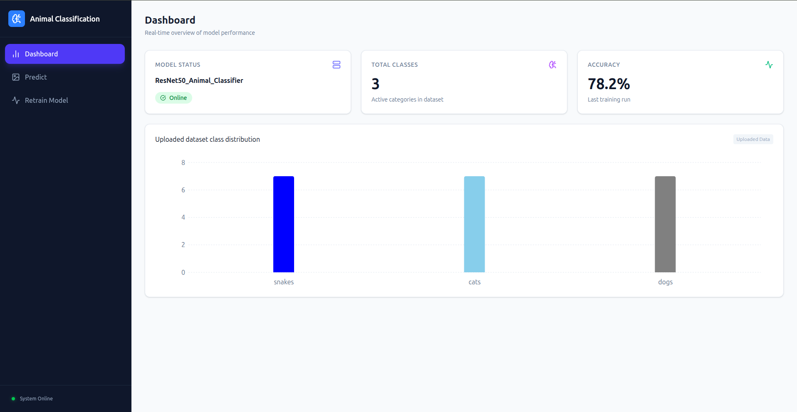

# Animal Classification (MLP Summative)

A full-stack Machine Learning application that classifies images of animals (Cats, Dogs, Snakes) and supports asynchronous model retraining using a background worker pipeline.

## Youtube Demo Video

Link: [https://youtu.be/5pGFCmnxtv4](https://youtu.be/5pGFCmnxtv4)

## Screenshots

**Dashboard:**



**API docs:**


**Locust:**

The Locust API test results is found in `locust` folder:


## System Architecture

The project consists of three main components:

1. **Frontend (React + Vite)**: A dashboard for users to upload images for prediction, view dataset statistics, and trigger retraining.

2. **Backend API (FastAPI)**: Handles HTTP requests, serves predictions, and manages file uploads.

3. **ML Worker (Celery + Redis)**: A background task runner that processes heavy model training jobs without blocking the main API.

## Folder Structure Overview

```sh
.
├── backend/         # FastAPI application and Celery worker logic
├── frontend/        # React + Vite frontend dashboard
├── data/            # Dataset storage
│   └── raw/         # Organized training images (cats/, dogs/, snakes/, etc)
├── model/           # Stores the trained .pkl model and metadata .json
└── requirements.txt # Python dependencies for Backend and Worker
```

## Live demo (deployment)

**Frontend UI:**
- URL: https://mlp-summative-dt9p.onrender.com

**Backend:**
- URL: https://www.bugufi.link/Qamrgs

## Quick Start Guide

### **Prerequisites**

- **Docker** (for Redis)

- **Python 3.9+**

- **Node.js 18+**

### **Redis Setup**

Start the Redis container, which acts as the message broker between the API and the Worker.

```sh
docker run -d -p 6379:6379 --name redis-broker redis
```

### **Backend & Worker Setup**

Note: For more, refer to the [README.md](./backend/README.md) from `backend` folder.

Open a terminal in the project root.

1. **Install Dependencies:**

```sh
pip install -r requirements.txt
```

2. **Start the API:**

```sh
cd backend
cp .env.example .env
uvicorn main:app --reload --port 8000
```

*The API will be available at `http://localhost:8000`*

3. **Start the Celery Worker (in a new terminal):**

```sh
cd backend

# Linux/Mac
celery -A tasks worker --loglevel=info

# Windows
celery -A tasks worker --pool=solo --loglevel=info
```

### **Frontend Setup**

Note: For more, refer to the [README.md](./frontend/README.md) from `frontend` folder.

Open a new terminal in the frontend directory.

1. **Install Dependencies:**

```sh
npm install
```

2. **Add ENV variables:**

```sh
cp .env.example .env
```

Edit the variables to match your setup

2. **Start the Dashboard:**

```sh
npm run dev
```

The UI will be available at http://localhost:5173

## License

MIT

## Contributors

- Egide HARERIMANA <h.egide@alustudent.com>