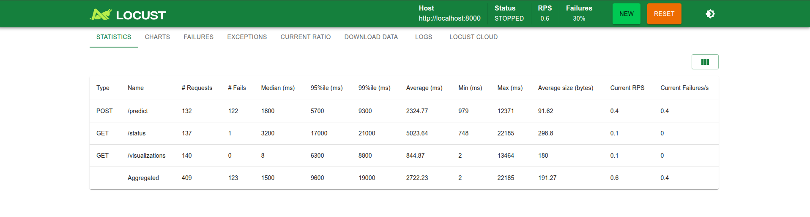
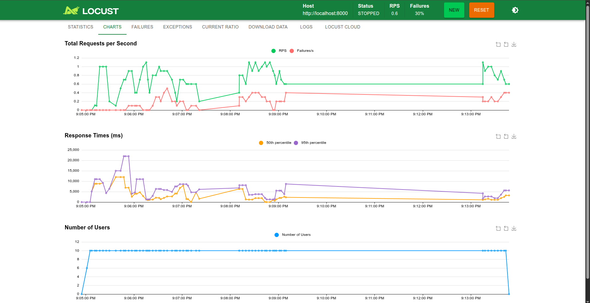

# Animal Classification Backend

This directory contains the Python logic for the FastAPI server and the Celery background worker for animal classification.

## Key Files

- `main.py`: The entry point for the FastAPI server. Handles HTTP routes.

- `tasks.py`: Defines the Celery application and the retrain_model_task. Contains the actual TensorFlow/Keras training logic.

- `models.py`: Helper module to load the serialized model (.pkl) and metadata safely.

- `prediction.py`: Contains image preprocessing and inference logic.

## Prerequisites

- **Docker** (for Redis)

- **Python 3.9+**

## Setup

Open a terminal in the `project` root.

1.  Dependencies:

```sh
pip install -r requirements.txt
```

2. Start the API:

```sh
cd backend
cp .env.example .env # Edit env variables afterwards
uvicorn main:app --reload --port 8000
```


The API will be available at [http://localhost:8000](http://localhost:8000)

OpenAPI docs: [http://localhost:8000/docs](http://localhost:8000/docs)

Redoc UI: [http://localhost:8000/redoc](http://localhost:8000/redoc)

## API Endpoints

The API documentation can be found from:

1. OpenApi (Swagger)
    - Local: [https://localhost:8000/docs](https://localhost:8000/docs)
2. Redocs UI
    - Local: [https://localhost:8000/redoc](https://localhost:8000/redoc)


## Locust

The Locust API test results is found in `locust` folder:

**Screenshots:**





## The Celery Worker

The worker is responsible for the heavy lifting. It handles the model retraining in the background to avoid blocking the main thread.

### Redis

Start the Redis container, which acts as the message broker between the API and the Worker.

```sh
docker run -d -p 8201:6379 --name redis-broker redis
```

### On Linux / macOS

```sh
celery -A tasks worker --loglevel=info
```

### On Windows (IMPORTANT: use --pool=solo)

```sh
celery -A tasks worker --pool=solo --loglevel=info
```

## License

MIT

## Contributors

- Egide HARERIMANA <h.egide@alustudent.com>